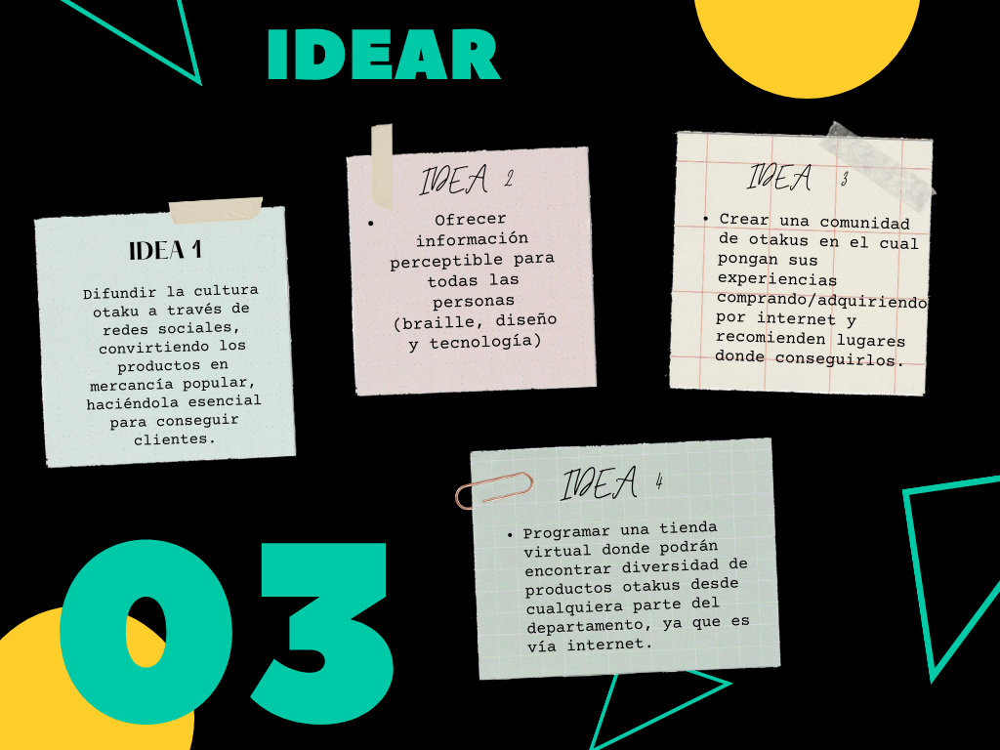

# <h0 style="font-size:60px; font-family:monospace;">AnimeWorld</h0>

Bienvenidos a AnimeWorld, un lugar donde encontrarás todo tipo de producto relacionado al Anime.
Desde accesorios hasta cosplay

## Metodologias

* <h1 style="font-size:40px; font-family:cursive;">Design Thinking</h1>
* <a style="font-family:monospace;" href="https://forms.gle/GXf8xwFXv5RSmZCFA">Encuesta realizada</a>
* <a style="font-family:monospace;" href="https://docs.google.com/forms/d/1VJs-nq1Bv4hehta-rt_h6zibriKAaAsjoFQ1sTfTJOA/edit#responses">Resultados de la encuesta</a>

 

  

  

  

  

  

  

  

  

  

  

  

  

  

* <h1 style="font-size:40px; font-family:cursive; margin-top:50px;">Learn StartUp</h1>
* <a style="font-family:monospace;" href="https://prezi.com/view/0FVVkxJW0927GnHZjNcp/">Para una mejor explicación</a>

 

  

  

  

  

  

  

  

  

  

### <h1 style="font-size:40px; font-family:cursive;">Links</h1>

* 
<a href="http://www.animeworld.com.mialias.net/tienda/">Aqui esta el link de la pagina </a>

* 
 <a href="https://web.facebook.com/AnimeWorld-102933282338598?_rdc=1&_rdr">El link de FB</a>

* 
 <a href="https://www.instagram.com/mundo_anime30/?hl=es-la">El link de Instagram</a>

* 
Usuario y contraseña de CDMON:

  
Usuario: animew137

  
Contraseña: ZbZi3on1

* 
<a href="https://drive.google.com/file/d/1HnDCKHwJYafunzfF5Add_l-1dmcMSDNB/view?usp=sharing">Link Video de la explicación del readme</a>

